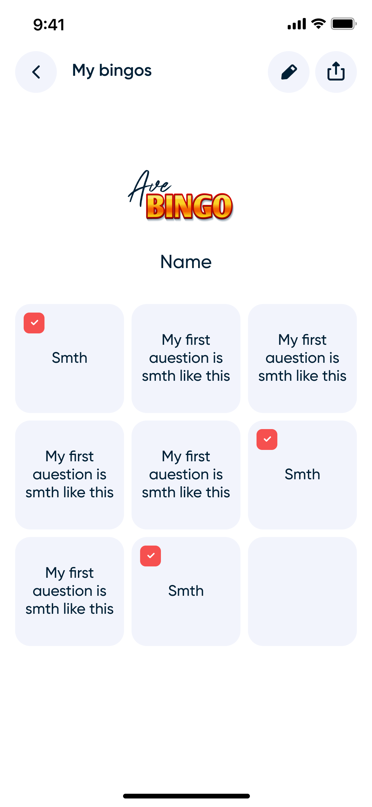

# Ave Bingo

Ave Bingo is an iOS app that lets you create and share custom Bingo cards with friends. You can share your Bingo cards via App Clips or directly within the app.

The app uses Alamofire for network requests and Mixpanel for user analytics. Additionally, it imports several public libraries for Lottie animations and custom implementations of swipe actions in SwiftUI.

  
  

  
  

